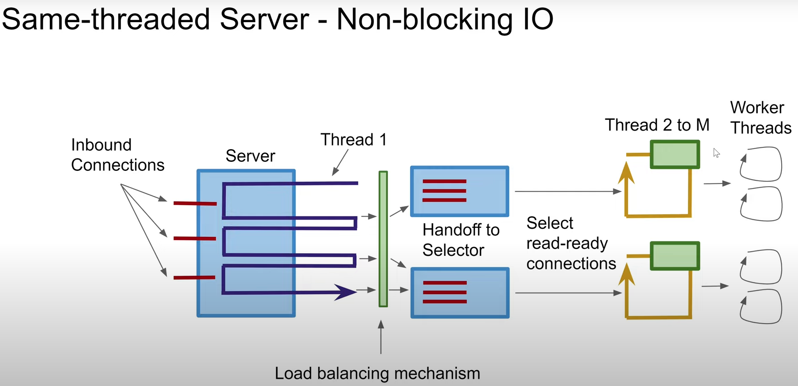
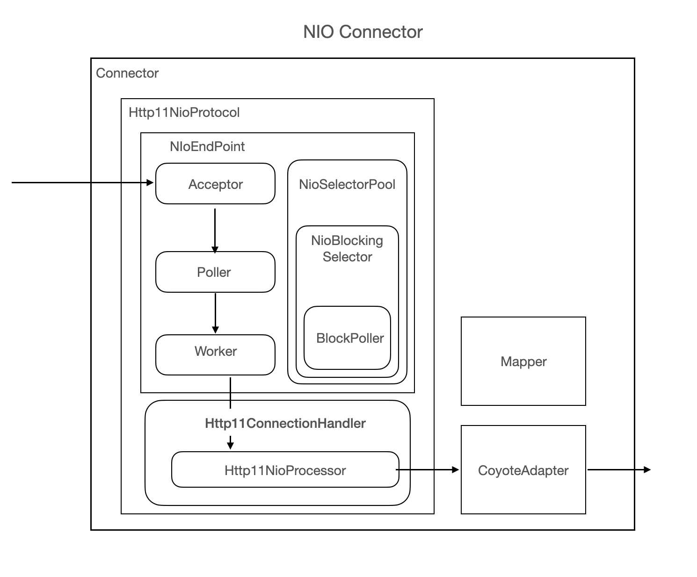
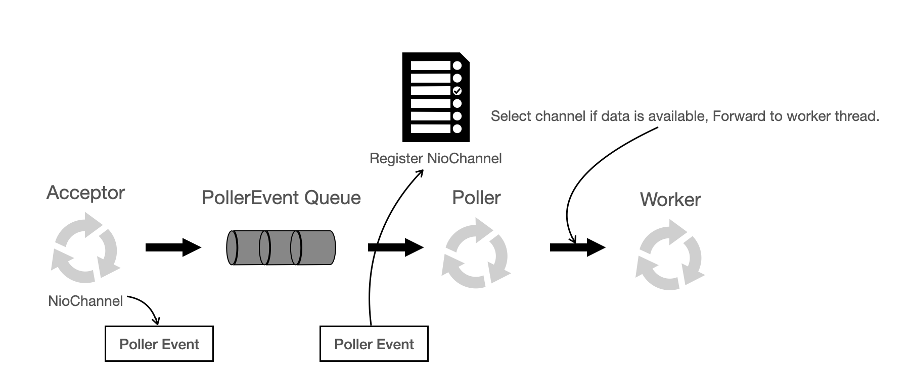

# Netty Usage Examples

This directory contains various examples demonstrating basic Netty usage patterns, organized by type.

## Prerequisites

Make sure you have Java 17+ and Maven installed. The Netty dependency is already configured in the `pom.xml` file.

## Directory Structure

The examples are organized into subdirectories by functionality:
- `echo/` - Echo server and client examples
- `http/` - HTTP server examples  
- `time/` - Time server examples
- `chat/` - Chat server examples
- `websocket/` - WebSocket server examples
- `file/` - File server examples

## Examples Included

### 1. Echo Server & Client (`echo/`)
- **Files**: `EchoServer.java`, `EchoClient.java`, `EchoServerHandler.java`
- **Purpose**: Demonstrates basic server-client communication
- **Server**: Echoes back any message received from clients
- **Client**: Connects to server and sends messages
- **Run Server**: `java netty.usage.echo.EchoServer [port]` (default: 8080)
- **Run Client**: `java netty.usage.echo.EchoClient [host] [port]` (default: localhost 8080)

### 2. Simple HTTP Server (`http/`)
- **Files**: `SimpleHttpServer.java`
- **Purpose**: Basic HTTP server responding to all requests
- **Features**: Returns request information and "Hello World" message
- **Run**: `java netty.usage.http.SimpleHttpServer [port]` (default: 8081)
- **Test**: Open `http://localhost:8081` in your browser

### 3. Time Server (`time/`)
- **Files**: `TimeServer.java`
- **Purpose**: Sends current timestamp to clients upon connection
- **Run**: `java netty.usage.time.TimeServer [port]` (default: 8082)
- **Test**: `telnet localhost 8082`

### 4. Chat Server (`chat/`)
- **Files**: `ChatServer.java`
- **Purpose**: Multi-client chat server that broadcasts messages
- **Features**: 
  - Supports multiple concurrent clients
  - Broadcasts messages to all connected clients
  - Shows join/leave notifications
- **Run**: `java netty.usage.chat.ChatServer [port]` (default: 8083)
- **Test**: `telnet localhost 8083` (open multiple terminals)

### 5. WebSocket Server (`websocket/`)
- **Files**: `WebSocketServer.java`
- **Purpose**: WebSocket server for real-time communication
- **Features**: Handles WebSocket handshake and echoes messages
- **Run**: `java netty.usage.websocket.WebSocketServer [port]` (default: 8084)
- **Test**: See detailed testing guide below

#### Testing the WebSocket Server

##### Method 1: Browser Developer Tools (Chrome/Firefox/Safari)

**Step 1: Start the WebSocket Server**
```bash
cd /Users/tyan/PersonalProjects/tyan-web-server-101
mvn exec:java -Dexec.mainClass="netty.usage.websocket.WebSocketServer"
```

**Step 2: Open Browser Developer Tools**
1. Open any web browser (Chrome, Firefox, Safari)
2. Navigate to any webpage (e.g., `google.com`)
3. Open Developer Tools:
   - **Chrome/Edge**: Press `F12` or `Ctrl+Shift+I` (Windows) / `Cmd+Option+I` (Mac)
   - **Firefox**: Press `F12` or `Ctrl+Shift+I` (Windows) / `Cmd+Option+I` (Mac)
   - **Safari**: Enable developer tools first, then `Cmd+Option+I`

**Step 3: Open Console Tab**
Click on the "Console" tab in the developer tools

**Step 4: Connect to WebSocket Server**
```javascript
// Create WebSocket connection
const ws = new WebSocket('ws://localhost:8084/ws');

// Handle connection open
ws.onopen = function(event) {
    console.log('Connected to WebSocket server');
    console.log('Connection established:', event);
};

// Handle incoming messages
ws.onmessage = function(event) {
    console.log('Received message:', event.data);
};

// Handle connection close
ws.onclose = function(event) {
    console.log('WebSocket connection closed:', event);
};

// Handle errors
ws.onerror = function(error) {
    console.log('WebSocket error:', error);
};
```

**Step 5: Send Test Messages**
```javascript
// Send a test message
ws.send('Hello from browser!');

// Send multiple messages
ws.send('How are you?');
ws.send('Testing WebSocket echo');

// Send JSON data
ws.send(JSON.stringify({message: 'Hello', timestamp: new Date()}));
```

**Step 6: Close Connection**
```javascript
// Close the WebSocket connection
ws.close();
```

##### Method 2: Browser WebSocket Test Page

**Use the provided HTML test client:**

1. The project includes a ready-to-use WebSocket test client at `src/main/resources/webpages/websocket-test.html`

2. Start the FileServer to serve the test page:
```bash
# Start FileServer in another terminal
mvn exec:java -Dexec.mainClass="netty.usage.file.FileServer"
```

3. Open the test client in your browser:
   - Navigate to: `http://localhost:8085/websocket-test.html`
   - Or access it via the main page: `http://localhost:8085/` → Click "📁 Browse Directory Listing" → Click `websocket-test.html`

4. Use the interactive test client:
   - Click "Connect to WebSocket Server" to establish connection
   - Type messages in the input field and press Enter or click "Send Message"
   - Try the test buttons: "Send Test Messages", "Send JSON Data", "Ping Test"
   - Monitor connection statistics and message logs in real-time

**Features of the HTML test client:**
- Real-time connection status indicator
- Message history with timestamps
- Predefined test messages for quick testing
- JSON data sending capability
- Ping/latency testing
- Message counters and connection time tracking
- Clear message log functionality

##### Method 3: Command Line WebSocket Clients

**Option A: Using wscat (Node.js)**
```bash
# Install wscat globally
npm install -g wscat

# Connect to WebSocket server
wscat -c ws://localhost:8084/ws

# Then type messages and see echoed responses
```

**Option B: Using websocat (Rust-based)**
```bash
# Install websocat (if you have Rust/Cargo)
cargo install websocat

# Or download binary from GitHub releases
# Connect to server
websocat ws://localhost:8084/ws
```

##### Method 4: Online WebSocket Test Tools

1. **WebSocket King**: https://websocketking.com/
   - Enter URL: `ws://localhost:8084/ws`
   - Click "Connect"
   - Send messages in the text area

2. **WebSocket.org Echo Test**: https://www.websocket.org/echo.html
   - Change URL to: `ws://localhost:8084/ws`
   - Test the connection

##### Expected Behavior

When testing, you should observe:

1. **Connection Establishment**: 
   - Server console shows: "WebSocket connection established"
   - Client shows successful connection

2. **Message Echo**: 
   - Send: "Hello World"
   - Receive: "Echo: Hello World"

3. **Real-time Communication**: 
   - Messages appear immediately
   - No HTTP request/response overhead

4. **Connection Management**: 
   - Proper connection close handling
   - Ping/pong frames for keep-alive

##### Troubleshooting

- **Connection Refused**: Ensure WebSocket server is running on port 8084
- **Handshake Failed**: Check the WebSocket URL format (`ws://localhost:8084/ws`)
- **CORS Issues**: When testing from browser, ensure you're accessing from `localhost`
- **Firewall**: Ensure port 8084 is not blocked

### 6. File Server (`file/`)
- **Files**: `FileServer.java`
- **Purpose**: Static file server serving files from current directory
- **Features**: 
  - Serves files with appropriate MIME types
  - Handles chunked file transfer for large files
  - Basic error handling for missing files
- **Run**: `java netty.usage.file.FileServer [port]` (default: 8085)
- **Test**: Open `http://localhost:8085` in your browser

## Building and Running

1. **Compile the project**:
   ```bash
   mvn compile
   ```

2. **Run any example**:
   ```bash
   mvn exec:java -Dexec.mainClass="netty.usage.echo.EchoServer"
   ```

   Or compile and run directly:
   ```bash
   mvn compile exec:java -Dexec.mainClass="netty.usage.echo.EchoServer"
   ```

## Key Netty Concepts Demonstrated

- **Bootstrap & ServerBootstrap**: Setting up clients and servers
- **EventLoopGroup**: Managing I/O threads (boss and worker groups)
- **ChannelInitializer**: Configuring the channel pipeline
- **ChannelHandler**: Processing inbound and outbound events
- **ByteBuf**: Netty's buffer implementation
- **Codecs**: HTTP, WebSocket, String, and frame-based protocols
- **Channel Groups**: Managing multiple connections
- **Chunked Transfer**: Efficient large file handling

## Testing the Examples

1. **Echo Server/Client**: 
   - Start EchoServer in one terminal
   - Run EchoClient in another terminal

2. **HTTP Server**: 
   - Start SimpleHttpServer
   - Open browser to `http://localhost:8081`

3. **Chat Server**: 
   - Start ChatServer
   - Connect multiple telnet clients: `telnet localhost 8083`
   - Type messages in any client to broadcast to all

4. **File Server**: 
   - Create some test files (HTML, CSS, images) in the project directory
   - Start FileServer
   - Access files via browser: `http://localhost:8085/filename`

## Notes

- All servers use different default ports to avoid conflicts
- Press Ctrl+C to stop any running server
- Check console output for connection status and errors
- Ensure firewall allows connections on the specified ports


## Key Learnings: Netty EventLoop vs Tomcat NIO Architecture

### EventLoop Architecture Deep Dive

**Netty's Single-Threaded-Per-Channel Model:**
- Each `EventLoop` runs on exactly one thread and handles multiple channels
- Channels are permanently bound to the same `EventLoop` for their lifetime (thread affinity)
- All I/O operations and business logic for a channel execute on the same thread
- `NioEventLoopGroup()` creates 2 × CPU cores EventLoops by default

**Key Architectural Benefits:**

1. **Lock-Free Channel Operations**: No synchronization needed for channel-specific data since only one thread accesses each channel
2. **Minimal Context Switching**: I/O detection, processing, and response writing happen on the same thread
3. **Better CPU Cache Utilization**: Thread-local data structures reduce cache misses and improve temporal locality
4. **Simplified Concurrency**: No coordination needed between I/O and business logic threads

### Tomcat NIO vs Netty Comparison

| Aspect | Tomcat NIO | Netty EventLoop |
|--------|------------|-----------------|
| **Thread Model** | Acceptor → Poller → Worker Thread Pool | Single EventLoop thread per channel group |
| **Channel Access** | Multiple worker threads can access same socket (HTTP keep-alive) | Single thread per channel (thread affinity) |
| **Synchronization** | Required for concurrent socket writes/reads | Not needed for channel operations |
| **Buffer Management** | Shared buffer pools with coordination overhead | Thread-local buffers per EventLoop |
| **Context Switching** | Poller → Worker handoff required | Everything on same thread |

### Critical Design Considerations

**Tomcat's Multi-Threading Challenges:**
- HTTP keep-alive connections can be processed by different worker threads
- Requires synchronization for concurrent socket access (read/write locks)
- Shared buffer pools need coordination between threads
- Cache misses occur when threads access shared data structures

**Netty's EventLoop Constraints:**
- **Never block the EventLoop thread** - offload blocking I/O to separate thread pools
- Business logic (UserController) should execute on dedicated thread pools
- Database calls, file I/O, or any blocking operations will freeze all channels on that EventLoop

**Best Practices for Netty:**
```java
// ❌ BAD - Blocks EventLoop thread
public void channelRead(ChannelHandlerContext ctx, Object msg) {
    String result = database.query("SELECT * FROM users"); // Blocks entire EventLoop!
    ctx.writeAndFlush(result);
}

// ✅ GOOD - Offload blocking work
public void channelRead(ChannelHandlerContext ctx, Object msg) {
    businessExecutor.submit(() -> {
        String result = database.query("SELECT * FROM users");
        ctx.channel().eventLoop().execute(() -> {
            ctx.writeAndFlush(result); // Back on EventLoop for I/O
        });
    });
}
```

## Architecture Diagrams

The project includes visual diagrams that illustrate the key architectural differences between Netty and Tomcat:

### Netty EventLoop Architecture


**Key Points Illustrated:**
- **Single EventLoop Thread**: Each EventLoop runs on exactly one thread
- **Channel Affinity**: Channels are permanently bound to their EventLoop
- **I/O + Business Logic**: Both network I/O and request processing happen on the same thread
- **No Thread Handoffs**: Eliminates context switching between I/O detection and processing
- **Lock-Free Operations**: No synchronization needed for channel-specific operations

### Tomcat NIO Connector Architecture  



**Key Points Illustrated:**
- **Multi-Stage Pipeline**: Acceptor → Poller → Worker Thread Pool
- **Thread Handoffs**: Requests pass through multiple thread pools
- **Shared Resources**: Multiple worker threads can access the same socket connection
- **Synchronization Required**: Concurrent access to sockets needs coordination
- **Context Switching Overhead**: Thread transitions add latency

### Performance Implications

**Netty's Advantages:**
- **Lower Latency**: No thread handoffs reduce request processing time
- **Higher Throughput**: Better CPU cache utilization and fewer context switches
- **Memory Efficiency**: Thread-local buffers eliminate contention
- **Predictable Performance**: Single-threaded model avoids lock contention

**Trade-offs to Consider:**
- **Blocking Operations**: Must be carefully managed to avoid EventLoop starvation
- **CPU-Intensive Tasks**: Should be offloaded to dedicated thread pools
- **Error Isolation**: One misbehaving handler can affect all channels on an EventLoop

These diagrams help visualize why Netty often outperforms traditional servlet containers for high-concurrency, low-latency applications.

## References
- [Single-threaded and Same-threaded designs](https://www.youtube.com/watch?v=QrYIOs1dA3M&list=PLL8woMHwr36EDxjUoCzboZjedsnhLP1j4&index=23&ab_channel=JakobJenkov)
- [BIO-NIO-Connector-in-Tomcat](https://velog.io/@jihoson94/BIO-NIO-Connector-in-Tomcat)
